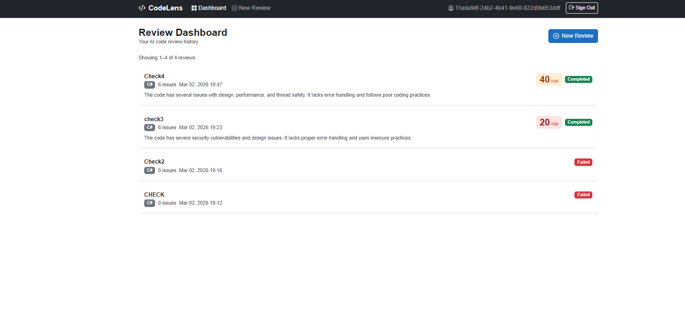
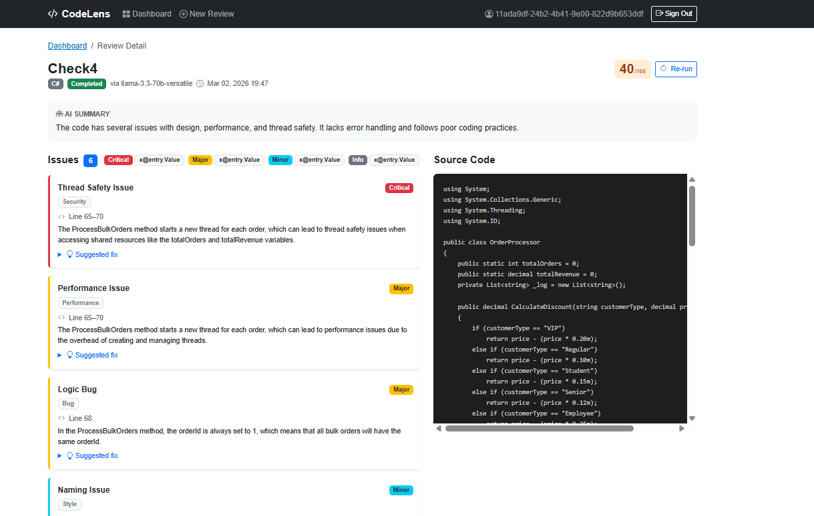

# CodeLens — AI Code Review

A full-stack web app that submits code snippets for automated review using an AI model. The AI returns a quality score, a summary, and a list of categorised issues with suggested fixes.

Built as a portfolio project to demonstrate clean architecture, API design, and Blazor WebAssembly.

---

## Screenshots

**Review Dashboard — paginated review history**


**Submit a review — paste code and select language**


**Review detail — issues, severity badges, suggested fixes**


---

## Tech Stack

| Layer | Technology |
|---|---|
| Frontend | Blazor WebAssembly (.NET 10) |
| Backend | ASP.NET Core Web API (.NET 10) |
| Database | SQL Server (LocalDB for dev) |
| ORM | Entity Framework Core 10 |
| Auth | ASP.NET Core Identity + JWT |
| AI | Groq API (`llama-3.3-70b-versatile`) |
| CQRS | MediatR |
| Validation | FluentValidation |
| API Docs | Swagger / OpenAPI |

---

## Architecture

The solution follows **Clean Architecture** with four projects:

```
CodeLens.Domain          → Entities, enums, domain interfaces
CodeLens.Application     → CQRS handlers, DTOs, validators, interfaces
CodeLens.Infrastructure  → EF Core, Identity, JWT, Groq integration
CodeLens.Api             → ASP.NET Core controllers, middleware
CodeLens.Web             → Blazor WASM frontend
```

---

## Getting Started

### Prerequisites

- [.NET 10 SDK](https://dotnet.microsoft.com/download)
- SQL Server LocalDB (included with Visual Studio)
- A free [Groq API key](https://console.groq.com)

### 1. Set secrets

```bash
cd src/CodeLens.Api
dotnet user-secrets set "JwtSettings:SecretKey" "your-secret-min-32-characters-long"
dotnet user-secrets set "Groq:ApiKey" "gsk_..."
```

### 2. Create the database

```bash
dotnet ef database update
```

### 3. Run the API

```bash
dotnet run
# Swagger UI → http://localhost:5089
```

### 4. Run the frontend

```bash
cd ../CodeLens.Web
dotnet run
# App → http://localhost:5199
```

---

## Features

- **Register / Login** — JWT-based authentication with password hashing and account lockout
- **Submit code for review** — paste any code snippet, select a language, get AI feedback
- **Review dashboard** — paginated history of all your reviews
- **Review detail** — full breakdown of issues with severity badges, line numbers, and suggested fixes
- **Re-run** — re-submit an existing review to the AI
- **Rate limiting** — fixed-window rate limiter on auth endpoints to prevent brute force

---

## API Endpoints

| Method | Route | Description |
|---|---|---|
| POST | `/api/auth/register` | Create account |
| POST | `/api/auth/login` | Login, returns JWT |
| GET | `/api/auth/me` | Current user profile |
| POST | `/api/reviews` | Submit code for review |
| GET | `/api/reviews` | Paginated review history |
| GET | `/api/reviews/{id}` | Review detail |
| POST | `/api/reviews/{id}/rerun` | Re-run AI analysis |
| GET | `/health` | Health check |
